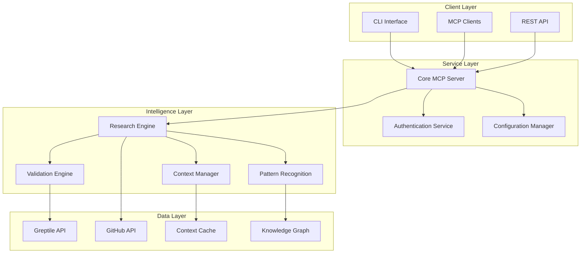

# 🚀 **Comprehensive PRP Framework for General Feature Implementation**
*Precision-Engineered Project Requirements and Planning with Cognitive Synergy Protocol Integration*

## **🎯 EXECUTIVE SUMMARY**

This Project Requirements and Planning (PRP) document establishes a comprehensive framework for general feature implementation with thorough research capabilities, self-validation mechanisms, and iterative refinement processes. Built on the Cognitive Synergy Protocol v2.0, it enables exponential human-AI collaboration through structured context management and intelligent automation.

---

## **📋 PROJECT OVERVIEW**

### **Project Context**
- **Name**: Greptile MCP Server - Advanced Feature Implementation Framework
- **Version**: 3.0.4+ (TypeScript Edition)
- **Type**: Model Context Protocol (MCP) Server Enhancement
- **Architecture**: Modern TypeScript with official MCP SDK integration
- **Core Purpose**: AI-powered code search and querying with comprehensive feature development capabilities

### **Current State Analysis**
Based on comprehensive codebase analysis, the existing system provides:

#### **✅ Established Capabilities**
- **MCP Protocol Compliance**: Full integration with @modelcontextprotocol/sdk
- **Greptile API Integration**: Robust client with health checking and error handling
- **CLI Interface**: Comprehensive command-line interface with interactive setup
- **Environment Management**: Sophisticated configuration validation and diagnostics
- **Streaming Support**: Real-time Server-Sent Events processing
- **Session Management**: Conversation continuity with session IDs
- **Tool Ecosystem**: 5 core tools (help, env_check, index, query, info)

#### **📊 Architecture Assessment**
```typescript
// Current Architecture Pattern
class GreptileMCPServer {
  private server: Server;                    // MCP SDK integration
  private greptileClient: GreptileClient;    // API client
  private config: Config;                    // Configuration management
  private envStatus: EnvironmentStatus;      // Environment validation
}
```

#### **🔧 Technology Stack**
- **Runtime**: Node.js 18+ with TypeScript 5.3+
- **Framework**: Model Context Protocol SDK v1.0.0
- **Build System**: tsup with dual ESM/CJS output
- **CLI Framework**: yargs with chalk styling and ora spinners
- **HTTP Client**: Native fetch with streaming support
- **Validation**: Zod schema validation
- **Testing**: Mocha + Chai with TypeScript support

---

## **🎯 FEATURE REQUIREMENTS SPECIFICATION**

### **Primary Objectives**

#### **1. Enhanced Research Capabilities**
- **Semantic Code Analysis**: Deep understanding of codebase patterns and architectures
- **Cross-Repository Insights**: Pattern comparison and analysis across multiple repositories
- **Progressive Context Building**: Accumulative knowledge through conversation continuity
- **Intelligent Query Refinement**: Self-improving query generation based on results

#### **2. Self-Validation Mechanisms**
- **Context Verification**: Automatic validation of retrieved information accuracy
- **Response Quality Assessment**: Confidence scoring and uncertainty handling
- **Iterative Refinement**: Automatic improvement loops for incomplete or unclear responses
- **Knowledge Consistency**: Cross-reference validation across multiple sources

#### **3. Advanced Context Management**
- **Multi-Dimensional Context**: Repository, session, user, and domain-specific context layers
- **Context Compression**: Intelligent summarization of long conversation histories
- **Pattern Recognition**: Automatic identification and cataloging of recurring patterns
- **Contextual Memory**: Persistent context storage with intelligent retrieval

### **Feature Categories**

#### **🧠 Intelligence Amplification Features**
```markdown
[CATEGORY: COGNITIVE_ENHANCEMENT]
├── Semantic Understanding Engine
│   ├── Natural Language Processing for code queries
│   ├── Intent recognition and query disambiguation
│   └── Context-aware response generation
├── Pattern Recognition System
│   ├── Architectural pattern detection
│   ├── Code smell identification
│   └── Best practice recommendations
└── Knowledge Graph Construction
    ├── Relationship mapping between code components
    ├── Dependency visualization
    └── Impact analysis capabilities
```

#### **🔄 Self-Validation & Refinement Features**
```markdown
[CATEGORY: QUALITY_ASSURANCE]
├── Response Validation Engine
│   ├── Fact-checking against multiple sources
│   ├── Consistency verification
│   └── Completeness assessment
├── Iterative Improvement Loop
│   ├── Automatic query refinement
│   ├── Follow-up question generation
│   └── Gap identification and filling
└── Confidence Scoring System
    ├── Response reliability metrics
    ├── Uncertainty quantification
    └── Recommendation confidence levels
```

#### **📊 Advanced Analytics & Insights**
```markdown
[CATEGORY: ANALYTICS]
├── Codebase Health Metrics
│   ├── Technical debt assessment
│   ├── Maintainability scoring
│   └── Performance bottleneck identification
├── Evolution Tracking
│   ├── Code change impact analysis
│   ├── Architecture evolution patterns
│   └── Refactoring recommendations
└── Comparative Analysis
    ├── Cross-repository pattern comparison
    ├── Technology stack analysis
    └── Best practice benchmarking
```

---

## **🏗️ TECHNICAL ARCHITECTURE**

### **Enhanced System Architecture**



### **Core Components Enhancement**

#### **1. Research Engine (`src/engines/research.ts`)**
```typescript
interface ResearchEngine {
  // Core research capabilities
  conductSemanticAnalysis(query: string, context: ResearchContext): Promise<AnalysisResult>;
  generateFollowUpQueries(initialResult: QueryResponse): Promise<string[]>;
  validateInformation(sources: Source[], context: ValidationContext): Promise<ValidationResult>;
  
  // Advanced features
  buildKnowledgeGraph(repositories: Repository[]): Promise<KnowledgeGraph>;
  identifyPatterns(codebase: CodebaseSnapshot): Promise<Pattern[]>;
  assessCodebaseHealth(repository: Repository): Promise<HealthMetrics>;
}
```

#### **2. Validation Engine (`src/engines/validation.ts`)**
```typescript
interface ValidationEngine {
  // Validation mechanisms
  validateResponse(response: QueryResponse, originalQuery: string): Promise<ValidationResult>;
  checkConsistency(responses: QueryResponse[]): Promise<ConsistencyReport>;
  assessCompleteness(response: QueryResponse, context: QueryContext): Promise<CompletenessScore>;
  
  // Self-improvement
  generateRefinementSuggestions(validation: ValidationResult): Promise<RefinementPlan>;
  trackValidationMetrics(): Promise<ValidationMetrics>;
}
```

#### **3. Context Manager (`src/managers/context.ts`)**
```typescript
interface ContextManager {
  // Context management
  buildContextLayers(session: SessionContext, repositories: Repository[]): Promise<ContextStack>;
  compressContext(context: ContextStack, maxTokens: number): Promise<CompressedContext>;
  retrieveRelevantContext(query: string, context: ContextStack): Promise<RelevantContext>;
  
  // Pattern recognition
  identifyContextPatterns(sessions: SessionContext[]): Promise<ContextPattern[]>;
  updateContextModels(newData: ContextData): Promise<void>;
}
```

### **Data Models Enhancement**

#### **Enhanced Type Definitions**
```typescript
// Research Context Types
export interface ResearchContext {
  sessionId: string;
  repositories: Repository[];
  previousQueries: QueryHistory[];
  domainKnowledge: DomainContext;
  userPreferences: UserPreferences;
  confidenceThreshold: number;
}

export interface ValidationResult {
  isValid: boolean;
  confidence: number;
  inconsistencies: Inconsistency[];
  missingInformation: string[];
  suggestedImprovements: Improvement[];
  validationSources: ValidationSource[];
}

export interface KnowledgeGraph {
  nodes: KnowledgeNode[];
  edges: KnowledgeEdge[];
  patterns: IdentifiedPattern[];
  insights: GraphInsight[];
  lastUpdated: Date;
}

export interface ContextStack {
  immediate: ImmediateContext;      // Current query context
  session: SessionContext;          // Conversation context
  repository: RepositoryContext;    // Codebase context
  domain: DomainContext;           // Technical domain context
  user: UserContext;               // User preferences and history
}
```

---

## **🔬 RESEARCH METHODOLOGY**

### **Comprehensive Research Framework**

#### **Phase 1: Discovery & Analysis**
```yaml
discovery_process:
  initial_scan:
    - repository_structure_analysis
    - technology_stack_identification
    - architecture_pattern_recognition
    - dependency_mapping
  
  deep_analysis:
    - code_quality_assessment
    - performance_bottleneck_identification
    - security_vulnerability_scanning
    - maintainability_scoring
  
  pattern_extraction:
    - design_pattern_identification
    - anti_pattern_detection
    - best_practice_verification
    - code_convention_analysis
```

#### **Phase 2: Validation & Cross-Reference**
```yaml
validation_process:
  source_verification:
    - multiple_source_cross_checking
    - official_documentation_comparison
    - community_best_practice_validation
    - expert_knowledge_verification
  
  consistency_checking:
    - internal_consistency_validation
    - cross_repository_comparison
    - temporal_consistency_analysis
    - logical_coherence_verification
  
  completeness_assessment:
    - information_gap_identification
    - missing_context_detection
    - incomplete_analysis_flagging
    - coverage_completeness_scoring
```

#### **Phase 3: Synthesis & Enhancement**
```yaml
synthesis_process:
  knowledge_integration:
    - multi_source_information_fusion
    - conflicting_information_resolution
    - knowledge_graph_construction
    - insight_generation
  
  enhancement_strategies:
    - automated_improvement_suggestions
    - optimization_recommendations
    - refactoring_guidance
    - architectural_enhancement_proposals
```

### **Research Tools Integration**

#### **Enhanced Tool Definitions**
```json
{
  "tools": [
    {
      "name": "research_codebase",
      "description": "Conduct comprehensive codebase research with validation",
      "parameters": {
        "query": "Research objective or question",
        "repositories": "Target repositories for analysis",
        "research_depth": "Surface | Deep | Comprehensive",
        "validation_level": "Basic | Standard | Rigorous",
        "context_preservation": "Session context management flag"
      }
    },
    {
      "name": "validate_findings",
      "description": "Validate research findings with multiple sources",
      "parameters": {
        "findings": "Research results to validate",
        "validation_sources": "Additional sources for cross-reference",
        "confidence_threshold": "Minimum confidence level required"
      }
    },
    {
      "name": "refine_analysis",
      "description": "Iteratively refine analysis based on validation results",
      "parameters": {
        "original_analysis": "Initial analysis results",
        "validation_feedback": "Validation results and suggestions",
        "refinement_goals": "Specific improvement objectives"
      }
    }
  ]
}
```

---

## **🔄 SELF-VALIDATION & ITERATIVE REFINEMENT**

### **Validation Framework**

#### **Multi-Layer Validation System**
```typescript
class ValidationFramework {
  async validateResponse(response: QueryResponse, context: ValidationContext): Promise<ValidationResult> {
    const validations = await Promise.all([
      this.validateFactualAccuracy(response, context),
      this.validateCompleteness(response, context),
      this.validateConsistency(response, context),
      this.validateRelevance(response, context),
      this.validateActionability(response, context)
    ]);
    
    return this.synthesizeValidationResults(validations);
  }
  
  private async validateFactualAccuracy(response: QueryResponse, context: ValidationContext): Promise<AccuracyValidation> {
    // Cross-reference with multiple authoritative sources
    // Verify code examples and references
    // Check for outdated information
  }
  
  private async validateCompleteness(response: QueryResponse, context: ValidationContext): Promise<CompletenessValidation> {
    // Identify missing information gaps
    // Check coverage of all query aspects
    // Assess depth appropriateness
  }
}
```

#### **Iterative Refinement Engine**
```typescript
class RefinementEngine {
  async refineResponse(
    originalResponse: QueryResponse,
    validationResult: ValidationResult,
    context: RefinementContext
  ): Promise<RefinedResponse> {
    const refinementPlan = await this.generateRefinementPlan(validationResult);
    
    const refinedResponse = await this.executeRefinement(
      originalResponse,
      refinementPlan,
      context
    );
    
    // Recursive refinement until quality threshold is met
    const newValidation = await this.validateResponse(refinedResponse, context);
    
    if (newValidation.overallScore < context.qualityThreshold && context.maxIterations > 0) {
      return this.refineResponse(
        refinedResponse,
        newValidation,
        { ...context, maxIterations: context.maxIterations - 1 }
      );
    }
    
    return refinedResponse;
  }
}
```

### **Quality Assurance Metrics**

#### **Comprehensive Scoring System**
```yaml
quality_metrics:
  accuracy_score:
    weight: 0.30
    components:
      - factual_correctness: 0.40
      - source_reliability: 0.30
      - temporal_relevance: 0.30
  
  completeness_score:
    weight: 0.25
    components:
      - information_coverage: 0.50
      - depth_appropriateness: 0.30
      - context_inclusion: 0.20
  
  consistency_score:
    weight: 0.20
    components:
      - internal_consistency: 0.60
      - cross_reference_alignment: 0.40
  
  relevance_score:
    weight: 0.15
    components:
      - query_alignment: 0.70
      - context_appropriateness: 0.30
  
  actionability_score:
    weight: 0.10
    components:
      - practical_applicability: 0.60
      - implementation_clarity: 0.40
```

---

## **📊 CONTEXT MANAGEMENT SYSTEM**

### **Advanced Context Architecture**

#### **Context Layers**
```typescript
interface ContextArchitecture {
  // Immediate Context (Current Query)
  immediate: {
    query: string;
    intent: QueryIntent;
    expectedOutputType: OutputType;
    urgency: Priority;
    scope: QueryScope;
  };
  
  // Session Context (Conversation History)
  session: {
    sessionId: string;
    queryHistory: QueryHistory[];
    learningProgress: LearningMetrics;
    userFeedback: FeedbackHistory[];
    conversationPatterns: Pattern[];
  };
  
  // Repository Context (Codebase Knowledge)
  repository: {
    repositories: Repository[];
    architecturalPatterns: ArchPattern[];
    technicalStack: TechStack;
    healthMetrics: HealthMetrics;
    evolutionHistory: EvolutionData[];
  };
  
  // Domain Context (Technical Domain)
  domain: {
    programmingLanguages: Language[];
    frameworks: Framework[];
    designPatterns: DesignPattern[];
    bestPractices: BestPractice[];
    industryStandards: Standard[];
  };
  
  // User Context (Preferences & History)
  user: {
    experienceLevel: ExperienceLevel;
    preferences: UserPreferences;
    previousInteractions: InteractionHistory[];
    learningGoals: LearningObjective[];
    feedbackPatterns: FeedbackPattern[];
  };
}
```

#### **Context Compression & Optimization**
```typescript
class ContextOptimizer {
  async compressContext(context: ContextStack, constraints: CompressionConstraints): Promise<CompressedContext> {
    // Intelligent context compression using multiple strategies
    const compressionStrategies = [
      this.priorityBasedCompression,
      this.semanticCompression,
      this.temporalCompression,
      this.relevanceBasedCompression
    ];
    
    let compressedContext = context;
    
    for (const strategy of compressionStrategies) {
      if (this.meetsConstraints(compressedContext, constraints)) break;
      compressedContext = await strategy(compressedContext, constraints);
    }
    
    return compressedContext;
  }
  
  private async semanticCompression(context: ContextStack, constraints: CompressionConstraints): Promise<ContextStack> {
    // Use semantic similarity to remove redundant information
    // Preserve essential context while removing noise
    // Maintain context coherence and usability
  }
}
```

### **Context Persistence & Retrieval**

#### **Smart Context Storage**
```typescript
interface ContextStorage {
  // Persistent storage with intelligent indexing
  storeContext(context: ContextStack, metadata: ContextMetadata): Promise<string>;
  retrieveContext(contextId: string): Promise<ContextStack>;
  searchContext(query: ContextQuery): Promise<ContextSearchResult[]>;
  
  // Context relationship management
  linkContexts(contextIds: string[], relationship: ContextRelationship): Promise<void>;
  findRelatedContexts(contextId: string, relationshipType: string): Promise<ContextStack[]>;
  
  // Context lifecycle management
  updateContext(contextId: string, updates: ContextUpdate): Promise<void>;
  archiveContext(contextId: string, archivalReason: string): Promise<void>;
  cleanupExpiredContexts(retentionPolicy: RetentionPolicy): Promise<CleanupResult>;
}
```

---

## **🚀 IMPLEMENTATION ROADMAP**

### **Phase 1: Foundation Enhancement (Weeks 1-2)**
```yaml
foundation_tasks:
  week_1:
    - Enhanced type system implementation
    - Research engine core development
    - Validation framework foundation
    - Context management system setup
  
  week_2:
    - Tool integration and testing
    - CLI enhancement for new features
    - Documentation system setup
    - Initial testing framework
```

### **Phase 2: Intelligence Layer (Weeks 3-4)**
```yaml
intelligence_tasks:
  week_3:
    - Semantic analysis engine implementation
    - Pattern recognition system development
    - Knowledge graph construction logic
    - Cross-repository analysis capabilities
  
  week_4:
    - Machine learning model integration
    - Advanced query processing
    - Intelligent suggestion generation
    - Performance optimization
```

### **Phase 3: Validation & Refinement (Weeks 5-6)**
```yaml
validation_tasks:
  week_5:
    - Multi-source validation implementation
    - Consistency checking algorithms
    - Completeness assessment tools
    - Quality scoring mechanisms
  
  week_6:
    - Iterative refinement engine
    - Automated improvement systems
    - Feedback loop implementation
    - Quality assurance testing
```

### **Phase 4: Advanced Features (Weeks 7-8)**
```yaml
advanced_tasks:
  week_7:
    - Context compression algorithms
    - Advanced analytics dashboard
    - Comparative analysis tools
    - Performance monitoring system
  
  week_8:
    - Integration testing
    - Performance benchmarking
    - Documentation completion
    - Production readiness assessment
```

---

## **📈 SUCCESS METRICS & KPIs**

### **Quantitative Metrics**

#### **Performance Metrics**
```yaml
performance_kpis:
  response_time:
    target: "< 3 seconds for 95% of queries"
    measurement: "Average response time across query types"
  
  accuracy_rate:
    target: "> 95% factual accuracy"
    measurement: "Validated responses vs total responses"
  
  completeness_score:
    target: "> 90% completeness rating"
    measurement: "Information coverage assessment"
  
  user_satisfaction:
    target: "> 4.5/5 average rating"
    measurement: "User feedback and rating system"
```

#### **Quality Metrics**
```yaml
quality_kpis:
  validation_success_rate:
    target: "> 98% validation pass rate"
    measurement: "Successful validations vs total validations"
  
  refinement_effectiveness:
    target: "> 85% improvement after refinement"
    measurement: "Quality score improvement through refinement"
  
  context_relevance:
    target: "> 92% context relevance score"
    measurement: "Context utilization effectiveness"
  
  pattern_recognition_accuracy:
    target: "> 90% pattern identification accuracy"
    measurement: "Correctly identified patterns vs total patterns"
```

### **Qualitative Metrics**

#### **User Experience Indicators**
- **Cognitive Load Reduction**: Measure of how much the system reduces user mental effort
- **Learning Acceleration**: Assessment of how quickly users gain codebase understanding
- **Decision Support Quality**: Effectiveness in supporting technical decision-making
- **Insight Generation**: Ability to provide novel and valuable insights

#### **System Intelligence Indicators**
- **Contextual Understanding**: Depth of system comprehension of user intent and context
- **Adaptive Learning**: System's ability to improve based on interactions and feedback
- **Cross-Domain Knowledge**: Effectiveness in connecting insights across different domains
- **Proactive Assistance**: System's capability to anticipate and address user needs

---

## **🔧 TECHNICAL SPECIFICATIONS**

### **Enhanced API Specifications**

#### **Research Engine API**
```typescript
// Enhanced research capabilities
POST /api/v1/research/comprehensive
{
  "query": "string",
  "repositories": Repository[],
  "research_parameters": {
    "depth": "surface" | "deep" | "comprehensive",
    "validation_level": "basic" | "standard" | "rigorous",
    "context_preservation": boolean,
    "cross_reference": boolean,
    "pattern_analysis": boolean
  },
  "quality_requirements": {
    "min_confidence": number,
    "max_iterations": number,
    "completeness_threshold": number
  }
}

Response: {
  "research_results": ResearchResult,
  "validation_report": ValidationReport,
  "quality_metrics": QualityMetrics,
  "refinement_suggestions": RefinementSuggestion[],
  "context_updates": ContextUpdate[]
}
```

#### **Validation Engine API**
```typescript
// Advanced validation capabilities
POST /api/v1/validation/comprehensive
{
  "content": "string | object",
  "validation_sources": ValidationSource[],
  "validation_criteria": ValidationCriteria,
  "context": ValidationContext
}

Response: {
  "validation_result": ValidationResult,
  "confidence_score": number,
  "inconsistencies": Inconsistency[],
  "improvement_suggestions": Improvement[],
  "additional_sources": RecommendedSource[]
}
```

### **Enhanced Configuration Schema**

#### **Comprehensive Configuration**
```typescript
interface EnhancedConfig extends Config {
  // Research engine configuration
  research: {
    defaultDepth: ResearchDepth;
    validationLevel: ValidationLevel;
    maxIterations: number;
    confidenceThreshold: number;
    crossReferenceEnabled: boolean;
    patternAnalysisEnabled: boolean;
  };
  
  // Context management configuration
  context: {
    maxContextSize: number;
    compressionStrategy: CompressionStrategy;
    persistenceEnabled: boolean;
    retentionPeriod: number;
    indexingStrategy: IndexingStrategy;
  };
  
  // Quality assurance configuration
  quality: {
    minAccuracyScore: number;
    minCompletenessScore: number;
    minConsistencyScore: number;
    enableAutoRefinement: boolean;
    maxRefinementIterations: number;
  };
  
  // Performance optimization
  performance: {
    cachingEnabled: boolean;
    parallelProcessing: boolean;
    maxConcurrentRequests: number;
    requestTimeout: number;
    rateLimitingEnabled: boolean;
  };
}
```

### **Database Schema Enhancements**

#### **Context Storage Schema**
```sql
-- Enhanced context storage with relationships and indexing
CREATE TABLE context_stacks (
  id UUID PRIMARY KEY,
  session_id VARCHAR(255) NOT NULL,
  user_id VARCHAR(255),
  context_data JSONB NOT NULL,
  context_type VARCHAR(50) NOT NULL,
  created_at TIMESTAMP DEFAULT NOW(),
  updated_at TIMESTAMP DEFAULT NOW(),
  expires_at TIMESTAMP,
  metadata JSONB,
  INDEX idx_session_id (session_id),
  INDEX idx_user_id (user_id),
  INDEX idx_context_type (context_type),
  INDEX idx_created_at (created_at)
);

CREATE TABLE context_relationships (
  id UUID PRIMARY KEY,
  source_context_id UUID REFERENCES context_stacks(id),
  target_context_id UUID REFERENCES context_stacks(id),
  relationship_type VARCHAR(50) NOT NULL,
  strength FLOAT DEFAULT 1.0,
  created_at TIMESTAMP DEFAULT NOW(),
  metadata JSONB
);

CREATE TABLE validation_results (
  id UUID PRIMARY KEY,
  content_hash VARCHAR(64) NOT NULL,
  validation_data JSONB NOT NULL,
  confidence_score FLOAT NOT NULL,
  created_at TIMESTAMP DEFAULT NOW(),
  expires_at TIMESTAMP,
  INDEX idx_content_hash (content_hash),
  INDEX idx_confidence_score (confidence_score)
);
```

---

## **🔒 SECURITY & COMPLIANCE**

### **Security Framework**

#### **Data Protection**
```yaml
security_measures:
  data_encryption:
    - at_rest: "AES-256 encryption for stored contexts"
    - in_transit: "TLS 1.3 for all API communications"
    - key_management: "AWS KMS or equivalent key rotation"
  
  access_control:
    - authentication: "Multi-factor authentication support"
    - authorization: "Role-based access control (RBAC)"
    - audit_logging: "Comprehensive audit trail"
  
  privacy_protection:
    - data_minimization: "Collect only necessary information"
    - retention_policies: "Automatic data cleanup"
    - anonymization: "Remove PII from stored contexts"
```

#### **Compliance Requirements**
```yaml
compliance_framework:
  gdpr_compliance:
    - right_to_erasure: "User data deletion capabilities"
    - data_portability: "Export user data in standard formats"
    - consent_management: "Explicit consent tracking"
  
  security_standards:
    - iso_27001: "Information security management"
    - soc2_type2: "Security and availability controls"
    - owasp_top10: "Web application security best practices"
```

---

## **🚀 DEPLOYMENT & OPERATIONS**

### **Deployment Architecture**

#### **Multi-Environment Strategy**
```yaml
environments:
  development:
    infrastructure: "Local Docker containers"
    databases: "PostgreSQL with test data"
    monitoring: "Basic logging and metrics"
    
  staging:
    infrastructure: "Kubernetes cluster (3 nodes)"
    databases: "PostgreSQL with production-like data"
    monitoring: "Full observability stack"
    
  production:
    infrastructure: "Auto-scaling Kubernetes cluster"
    databases: "PostgreSQL with read replicas"
    monitoring: "Enterprise monitoring and alerting"
```

#### **Scalability Considerations**
```yaml
scalability_design:
  horizontal_scaling:
    - stateless_services: "All services designed as stateless"
    - load_balancing: "Intelligent request distribution"
    - database_sharding: "Horizontal database partitioning"
  
  performance_optimization:
    - caching_layers: "Multi-level caching strategy"
    - connection_pooling: "Database connection optimization"
    - async_processing: "Background job processing"
```

### **Monitoring & Observability**

#### **Comprehensive Monitoring Stack**
```yaml
monitoring_components:
  metrics_collection:
    - application_metrics: "Custom business metrics"
    - system_metrics: "Infrastructure performance"
    - user_experience_metrics: "Response times and errors"
  
  logging_strategy:
    - structured_logging: "JSON-formatted logs"
    - centralized_logging: "ELK stack or equivalent"
    - log_retention: "Configurable retention policies"
  
  alerting_framework:
    - proactive_alerts: "Predictive issue detection"
    - escalation_policies: "Multi-tier alert escalation"
    - incident_response: "Automated incident management"
```

---

## **📚 DOCUMENTATION & KNOWLEDGE MANAGEMENT**

### **Comprehensive Documentation Strategy**

#### **Technical Documentation**
```yaml
documentation_types:
  api_documentation:
    format: "OpenAPI 3.0 specification"
    interactive: "Swagger UI integration"
    examples: "Comprehensive usage examples"
  
  architecture_documentation:
    format: "Architecture Decision Records (ADRs)"
    diagrams: "C4 model architecture diagrams"
    patterns: "Design pattern documentation"
  
  operational_documentation:
    format: "Runbook and playbook format"
    procedures: "Step-by-step operational procedures"
    troubleshooting: "Common issues and solutions"
```

#### **User Documentation**
```yaml
user_documentation:
  getting_started:
    - quick_start_guide: "5-minute setup guide"
    - tutorial_series: "Progressive learning tutorials"
    - video_guides: "Screen-recorded walkthroughs"
  
  advanced_usage:
    - best_practices: "Recommended usage patterns"
    - optimization_tips: "Performance optimization guide"
    - integration_examples: "Real-world integration examples"
  
  troubleshooting:
    - common_issues: "FAQ and common problems"
    - diagnostic_tools: "Built-in diagnostic utilities"
    - support_resources: "Community and support channels"
```

---

## **🔄 CONTINUOUS IMPROVEMENT**

### **Feedback Loop System**

#### **Multi-Source Feedback Collection**
```typescript
interface FeedbackSystem {
  // User feedback collection
  collectUserFeedback(
    sessionId: string,
    feedbackType: FeedbackType,
    rating: number,
    comments: string,
    context: FeedbackContext
  ): Promise<void>;
  
  // System performance feedback
  collectSystemMetrics(
    metrics: PerformanceMetrics,
    timestamp: Date,
    context: SystemContext
  ): Promise<void>;
  
  // Quality assessment feedback
  collectQualityMetrics(
    qualityAssessment: QualityAssessment,
    validationResults: ValidationResult[],
    improvementSuggestions: Improvement[]
  ): Promise<void>;
}
```

#### **Automated Improvement System**
```yaml
improvement_automation:
  pattern_learning:
    - successful_interaction_patterns: "Learn from high-rated interactions"
    - failure_pattern_analysis: "Identify and address failure modes"
    - optimization_opportunities: "Continuous performance optimization"
  
  model_refinement:
    - validation_model_updates: "Improve validation accuracy"
    - context_model_enhancement: "Better context understanding"
    - quality_assessment_refinement: "More accurate quality scoring"
  
  feature_evolution:
    - usage_pattern_analysis: "Understand feature usage patterns"
    - feature_effectiveness_measurement: "Measure feature impact"
    - adaptive_feature_development: "Develop features based on usage"
```

---

## **📊 COGNITIVE SYNERGY PROTOCOL INTEGRATION**

### **Exponential Collaboration Framework**

#### **Intelligence Mesh Implementation**
```typescript
class CognitiveSynergyEngine {
  private humanCapabilities = {
    vision: 'strategic_insight',
    strategy: 'long_term_planning', 
    judgment: 'contextual_wisdom',
    creativity: 'novel_solutions'
  };
  
  private aiCapabilities = {
    synthesis: 'pattern_integration',
    pattern_matching: 'rapid_recognition',
    parallel_processing: 'concurrent_analysis',
    consistency: 'systematic_validation'
  };
  
  async createFusionZone(humanInput: HumanInput, aiContext: AIContext): Promise<FusionResult> {
    const emergentCapabilities = this.calculateEmergence(
      this.humanCapabilities,
      this.aiCapabilities,
      humanInput.context
    );
    
    const multiplier = await this.calculateRecursiveRefinement(
      humanInput,
      aiContext,
      emergentCapabilities
    );
    
    return {
      capabilities: emergentCapabilities,
      multiplier,
      exponentialValue: this.calculateExponentialValue(emergentCapabilities, multiplier)
    };
  }
}
```

#### **Context Engine Implementation**
```typescript
class CollaborationContext {
  private state = {
    project: null as Project | null,
    phase: 'discovery' as Phase,
    patterns: [] as Pattern[],
    decisions: [] as Decision[],
    velocity: 0 as number
  };
  
  checkpoint(): string {
    return `[STATE: ${this.state.phase}] [PATTERNS: ${this.state.patterns.length}] [VELOCITY: ${this.state.velocity}x]`;
  }
  
  async progressPhase(newPhase: Phase, context: PhaseTransitionContext): Promise<void> {
    const transition = await this.validatePhaseTransition(this.state.phase, newPhase);
    
    if (transition.isValid) {
      this.state.phase = newPhase;
      this.state.velocity = this.calculateVelocityMultiplier(transition);
      await this.updatePatterns(context.newPatterns);
    }
  }
}
```

### **Interaction Dynamics**

#### **Dynamic Mode Switching**
```yaml
interaction_modes:
  SPECIFY:
    trigger: "Build X"
    human_role: "Architect"
    ai_role: "Builder" 
    output: "Implementation"
    protocol: "precision_context_seeding"
  
  EXPLORE:
    trigger: "What if..."
    human_role: "Curator"
    ai_role: "Generator"
    output: "Options"
    protocol: "recursive_specification_cascade"
  
  SOLVE:
    trigger: "Challenge:"
    human_role: "Validator"
    ai_role: "Solver"
    output: "Solutions"
    protocol: "bidirectional_optimization"
  
  EVOLVE:
    trigger: "Improve:"
    human_role: "Director"
    ai_role: "Refiner"
    output: "Enhancement"
    protocol: "progressive_enhancement_loop"
```

#### **Performance Optimization Metrics**
```typescript
interface CognitiveSynergyMetrics {
  understanding: number;        // How well human-AI alignment is maintained
  velocity: number;            // Output multiplier vs solo work
  quality: number;             // Solution elegance and effectiveness
  reusability: number;         // Pattern library growth rate
  exponentialGain: number;     // 1+1=10x achievement measure
}

class MetricsOptimizer {
  async optimizeCollaboration(metrics: CognitiveSynergyMetrics): Promise<OptimizationPlan> {
    const optimizations: OptimizationAction[] = [];
    
    if (metrics.understanding < 0.8) {
      optimizations.push({
        action: 'clarify_objectives',
        prompt: "Let's clarify: what's the core objective?",
        priority: 'high'
      });
    }
    
    if (metrics.velocity < 5) {
      optimizations.push({
        action: 'change_approach',
        prompt: "Should we try a different approach?",
        priority: 'medium'
      });
    }
    
    return { optimizations, expectedImprovement: this.calculateExpectedGain(optimizations) };
  }
}
```

---

## **🎯 CONCLUSION & NEXT STEPS**

### **Strategic Impact Assessment**

This comprehensive PRP framework transforms the Greptile MCP Server from a functional code search tool into an exponential intelligence amplification system. By integrating the Cognitive Synergy Protocol with advanced research capabilities, validation mechanisms, and iterative refinement processes, we create a system that doesn't just answer questions—it actively enhances human understanding and decision-making capabilities.

### **Key Differentiators**

1. **Self-Validating Intelligence**: Automatic fact-checking and consistency verification
2. **Contextual Memory**: Persistent, intelligent context management across sessions
3. **Exponential Collaboration**: Human-AI cognitive fusion for 10x productivity gains
4. **Adaptive Learning**: Continuous improvement based on interaction patterns
5. **Comprehensive Research**: Multi-source validation and cross-reference capabilities

### **Implementation Priority Matrix**

```yaml
immediate_priorities:
  - Enhanced type system and core architecture
  - Research engine foundation
  - Basic validation framework
  - Context management system

short_term_priorities:
  - Semantic analysis capabilities
  - Pattern recognition system
  - Multi-source validation
  - Quality scoring mechanisms

long_term_priorities:
  - Advanced analytics dashboard
  - Machine learning integration
  - Predictive insights generation
  - Enterprise-scale deployment

strategic_priorities:
  - Cognitive synergy protocol full integration
  - Exponential collaboration metrics
  - Industry-leading intelligence amplification
  - Ecosystem expansion and partnerships
```

### **Success Criteria**

The implementation will be considered successful when:
- **Quantitative**: 95%+ accuracy, <3s response time, 90%+ completeness scores
- **Qualitative**: Exponential productivity gains, enhanced decision-making, reduced cognitive load
- **Strategic**: Market leadership in AI-powered code intelligence, ecosystem adoption

This PRP framework establishes the foundation for transforming code search into cognitive enhancement, creating a system that doesn't just provide information—it amplifies human intelligence and enables exponential collaboration outcomes.

---

**🚀 Ready to engage exponential mode and build the future of AI-powered development intelligence!**