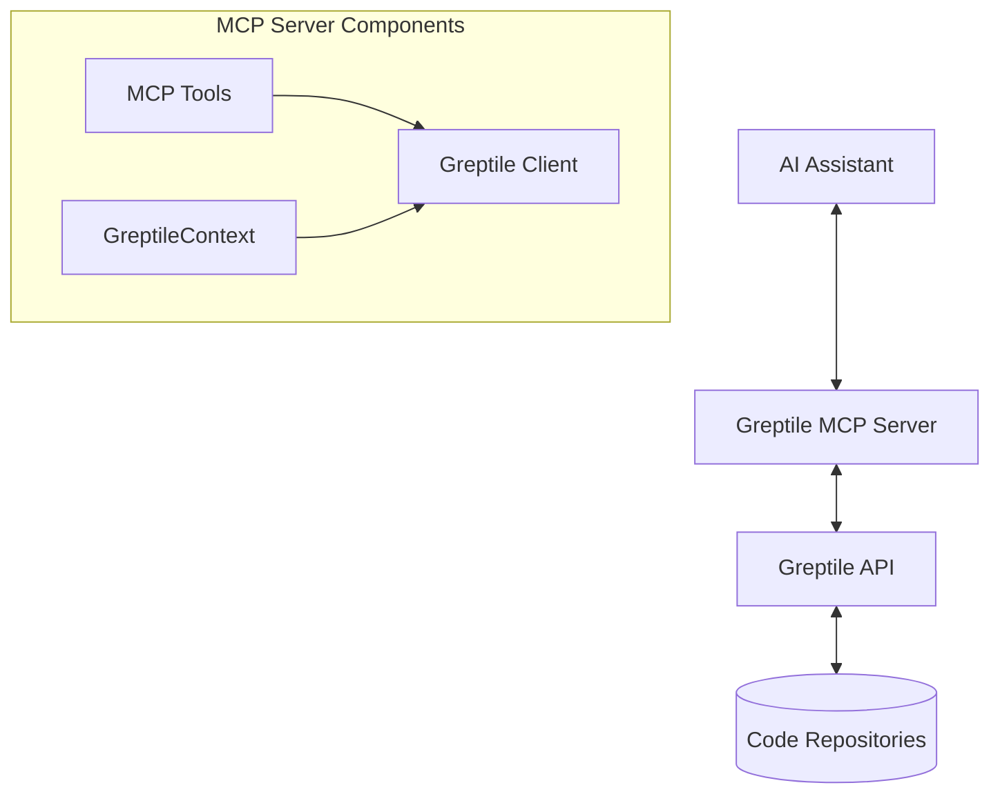

# Greptile MCP System Patterns

## Architecture Overview

## Key Components

### 1. FastMCP Server
- Implements the MCP protocol for tool definitions
- Provides the transport layer (SSE or stdio)
- Manages the lifecycle of the Greptile client
- Handles request context and error states

### 2. Greptile Client
- Manages authentication with the Greptile API
- Handles HTTP requests to the API endpoints
- Provides methods for repository operations
- Uses async patterns for non-blocking operations

### 3. MCP Tools
- **index_repository**: Initiates indexing of a repository
- **query_repository**: Sends natural language queries about repositories
- **search_repository**: Finds relevant files without generating answers
- **get_repository_info**: Retrieves metadata about indexed repositories

## Design Patterns

### 1. Dependency Injection
- The Greptile client is injected into the MCP context
- Allows for easier testing and component replacement

### 2. Context Manager Pattern
- The `greptile_lifespan` function manages the lifecycle of the client
- Ensures proper initialization and cleanup of resources

### 3. Async/Await Pattern
- All operations use async programming for better performance
- Compatible with the event-driven nature of the MCP protocol

### 4. Error Handling Strategy
- Each tool catches exceptions and returns formatted error messages
- Prevents server crashes while providing helpful feedback

## Data Flow

1. AI assistant calls an MCP tool with specific parameters
2. The MCP server processes the request and passes it to the Greptile client
3. The client makes API calls to Greptile and awaits responses
4. Results are formatted and returned to the AI assistant

## Configuration Management
- Environment variables for API keys and server settings
- Dotenv support for local development
- Containerization for deployment with environment configuration 